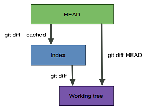

## Git Terminology
[HEAD](#HEAD) | 

## Git Command List
git [add](#git-add) | git [clone](#git-clone) |  git [commit](#git-commit) |  git [commit --amend](#git-commit---amend) | git [config](#git-config) | git [diff](#git-diff) | git [fetch](#git-fetch) | git [init](#git-init) | git [log](#git-log)  | git [mergetool](#mergetool) | git [pull](#git-pull) | git [push](#git-push) | git [remote](#git-remote) | git [rebase](#git-rebase) | git [reflog](#git-reflog) | git [reset --soft](#git-reset---soft) | git [status](#git-status) |

## Git Terminology
#### HEAD
HEAD is a pointer to the local branch you’re currently on [[Ref](https://git-scm.com/book/en/v2/Git-Branching-Branches-in-a-Nutshell#_switching_branches)].

## Git Examples

#### Make a change to a remote repo

```bash
git add <file/directory>
git diff --name-only --staged # show staged difference with respect to HEAD (file names only) 
git commit -m 'message'
git pull
git status
git push <remote> <branch>    # e.g. origin master
```

#### Unstage a staged file

```bash
git reset <file>
```

#### Get a mistakenly deleted file back

1. If staged: i.e. deleted from the Git index using `git rm <file>`
```bash
git reset <file>
git checkout <file>
```
2. if not staged: i.e. deleted outside the Git, so that the file can exist on the repo, but not the working directory
```bash
git checkout <file>
```

#### Squash n commits into 1

```bash
git reset --soft HEAD~<n>
```


## Git Discussions

#### Clone vs. Checkout vs. Pull vs. fetch

* `clone` is for fetching repositories you don't have, `checkout` is for switching between branches in a repository you already have. `checkout` can also be used to overwrite a file in your working copy with a version of that file from another revision [[Ref]( https://stackoverflow.com/questions/7298598/what-is-the-difference-between-git-clone-and-checkout#answer-7298621)]
* `pull`  is a `fetch` plus `merge` the changes into the *local branch* of the same name [[Ref]( https://stackoverflow.com/questions/7298598/what-is-the-difference-between-git-clone-and-checkout#answer-7298621)].
* `checkout` is a local operation that only operates on data that's already fetched [[Ref]( https://stackoverflow.com/questions/7298598/what-is-the-difference-between-git-clone-and-checkout#answer-7298621)].

#### Diffs 

`git diff` differences between the **working directory** and the **index**.

`git diff --staged`or `--cached` differences between the **index** and the **HEAD**. 

`git diff HEAD` differences between the **working directory** and **HEAD**. All changes since the last commit. 

 

[[Ref]( https://stackoverflow.com/questions/1587846/how-do-i-show-the-changes-which-have-been-staged?noredirect=1&lq=1)]

#### --amend vs. reset --soft:

- `git commit --amend` to add/rm files from the very last commit or to change its message.
- `git reset --soft HEAD~<n> ` `git commit -m "<message>"` to combine several sequential commits into a new one.

## Git Commands

#### Upgrade on Windows

```bash
 git update-git-for-windows
```


### Git Basics

#### git init

1. Create empty Git repo in specified directory. 
    * Run with no arguments to initialize the current directory as a git repository
```bash 
git init <directory>
```

#### git clone
1. Clone repo located at <repo> onto local machine. 

    *  Original repo can be located on the local filesystem or on a remote machine via HTTP or SSH.
```bash
git clone <repo>
```
2. Clone repo located at <repo> onto <target>
```bash
git clone <repo> <target>
```

#### git config
1. Define author name to be used for all commits in current repo. 

    * Devs commonly use --global flag to set config options for current user (configuration values on a global or local project level)

```bash
git config user.name <name>
```

#### git add
1. Stage all changes in <directory> / <file> for the next commit
    * Replace <directory> with a <file> to change a specific file.
```bash
git add <directory>
```

#### git commit
1. Commit the staged snapshot, use <message> as the commit message.

```bash
git commit -m "<message>"
```

#### git status
1. List which files are staged, unstaged, and untracked.

```bash
git status
```

#### git reset --soft

1. Combine several sequential commits into a new one.

```bash
git reset --soft HEAD~<n>
git commit -m "<message"> 
```

#### git log

1. Display the entire commit history using the default format.

    * For customization see additional options.
```bash
git log # --oneline
```

#### git diff
1. Show unstaged changes between your index and working directory.
```bash
git diff
```

### Resolve Conflicts

#### git mergetool

1. Resolve conflicts using `vimdiff` [[Ref]( https://stackoverflow.com/questions/161813/how-to-resolve-merge-conflicts-in-git)]
    * First run this:
      ```bash
      git mergetool
      ```
      ```
      ╔═══════╦══════╦════════╗
      ║ LOCAL ║ BASE ║ REMOTE ║ 
      ╠═══════╩══════╩════════╣
      ║        MERGED         ║
      ╚═══════════════════════╝
      ```
    
2. It gives you 4 views:
    * *LOCAL* – this is file from the current branch
    * *BASE* – common ancestor, how file looked before both changes
    * *REMOTE* – file you are merging into your branch
    * *MERGED* – merge result, this is what gets saved in the repo 
    
3. You could edit the **MERGED** view: 
    * If you want to get changes from REMOTE
      ```base
      :diffg RE  
      ```
    * If you want to get changes from BASE
      ```base
      :diffg BA
      ```
    * If you want to get changes from LOCAL
      ```base
      :diffg LO
      ```
    
4. `:wqa` save and exit

5. You probably need to squash commits into one (if note, just do the last commit command):  

    ```bash
    git status # get <n>
    git reset --soft HEAD~<n>
    git commit -m "<message">   
    ```

6. `git clean` Remove extra **.orig* created by diff tool (`-f`?)


### Undoing Changes

#### git revert
1. Create new commit that undo all of the changes made in <commit>, then apply it to the current branch.

```bash 
git revert <commit>
```

### Rewriting Git History

#### git commit --amend

1. Replace the last commit with the **staged** changes and last commit combined.
    * Amended commits are entirely new commits and the previous commit will no longer be on your current branch (history-rewriting [[Ref]( https://www.atlassian.com/git/tutorials/rewriting-history )])
    * If you commit once, then try to commit again, you'll get *Your branch is ahead of 'origin/master' by 1 commit.  (use "git push" to publish your local commits)*.  

2.  Or use with **nothing staged** to only edit the last commit’s message.
    
```bash
git commit --amend -m "<message>"
```

#### git rebase

1. Rebase the current branch onto <base>. 
    * The <base> can be a *commit ID*, a *branch name*, a *tag*, or a *relative reference to `HEAD`*.
```bash
git rebase <base>
```

#### git reflog

1. Show a log of changes to the local repository’s `HEAD`. 
    * Add `--relative-date` flag to show date info or `--all` to show all refs.
```bash
git reflog
```

### Remote Repositories

#### git remote 
1. Create a new connection to a remote repo. Use <name> as a shortcut for <url>
    * After adding a remote, you can use <name> as a shortcut for <url> in other commands.
```bash 
git remote add <name> <url>
```

#### git fetch
1. Fetch a specific <branch>, from the repo.
```bash 
git fetch <remote> <branch>
```

2. Leave off <branch> to fetch all remote refs.
```bash 
git fetch <remote>
```

#### git pull

1. Fetch the specified remote’s copy of current branch and immediately merge it into the local copy

```bash
git pull <remote>
```

#### git push 
1. Push the branch to <remote>, along with necessary commits and objects. 
    * Creates named branch in the remote repo if it doesn’t exist.
```bash
git push <remote> <branch>
```

